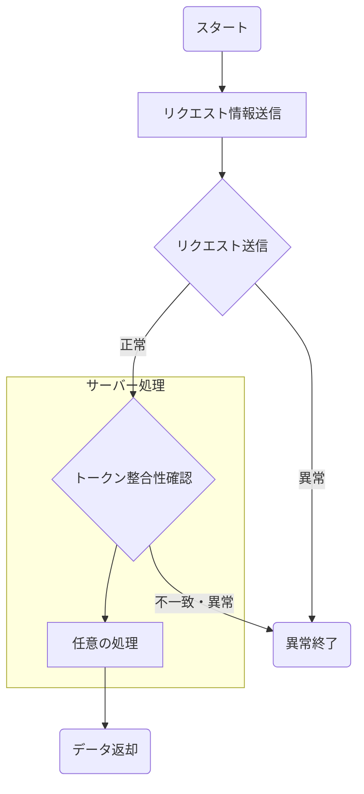

# API共通機能

本頁では、クライアントとサーバー側の共通機能についての定義を行う

## フロー詳細

### API共通処理

#### リクエスト情報送信

APIリクエストのセットアップを実施する

##### JSONリクエスト - Httpヘッダー情報

| カテゴリ | キー名称 | 値 | 備考 |
| ---- | ---- | ---- | ---- |
| HTTPメソッド | Method | 処理に応じて変更 |  |
| HTTPヘッダー | Authentication | Bearer: + Firebaseから発行されたIDトークン | IDトークンはFirebaseの処理を介すると発行される |
| HTTPヘッダー | Content-type | application/json |  |
| HTTPヘッダー | Accept | application/json, \*/\* |  |

※Httpのクエリパラメータ・Bodyについては処理に応じて変更する為、こちらでは割愛

**また学会利用者向けの機能については、Firebaseから発行されたIDトークンは存在しないため、Authenticationは外したものを使用する**

//TODO: 同意書アップロードの機能もあるため、multipart/formdataの記載も必要

#### リクエスト送信

サーバー側へリクエストを実施する
サーバー側の応答の結果、下記のエラーが発生した場合は次項目のエラーメッセージを画面に描画し終了

| ステータスコード | エラーメッセージ | 備考 |
| ---- | ---- | ---- |
| 400番台 | エラーが発生しました | クライアント側エラー、不正なリクエストの場合該当の結果が返却される |
| 500番台 | エラーが発生しました | サーバー側エラー、ネットワークやプログラムの不具合が発生した場合、該当の結果が返却される |

エラーが上記の処理を実施した

#### トークン整合性確認

**学会利用者向けの機能については、トークンが付与されていない為、本処理はスキップする**

サーバーへの疎通が送信が完了した場合、Firebaseのトークンの整合性の確認を実施する
上記の処理を実施することにより、本Appにて認証を受けてないリクエストはブロックすることが可能となる

リクエストにて送信した`Bearer: + Firebaseから発行されたIDトークン`を取得し、
Firebaseのトークンの整合性確認を実施し、判定を行う。

- トークンの整合性が確認できた場合
  - [任意の処理](#任意の処理4)へと進む
- トークンの整合性が確認できなかった場合
  - 403エラーを返却する

#### 任意の処理

呼び出し先のAPIに従い、処理を実施する
※処理に応じて異なる為、本処理の詳細は割愛

#### データ返却

任意の処理に応じてデータを返却する
データの形式はリクエスト送信の`Content-Type`に応じて返却する

#### 異常終了

サーバーへの疎通が失敗した場合、またはトークンの整合性が確認できなかった場合は
任意のエラーメッセージを画面上に表示し終了する

| ステータスコード | エラーメッセージ | 備考 |
| ---- | ---- | ---- |
| 400番台 | エラーが発生しました | クライアント側エラー、不正なリクエストの場合該当の結果が返却される |
| 500番台 | エラーが発生しました | サーバー側エラー、ネットワークやプログラムの不具合が発生した場合、該当の結果が返却される |