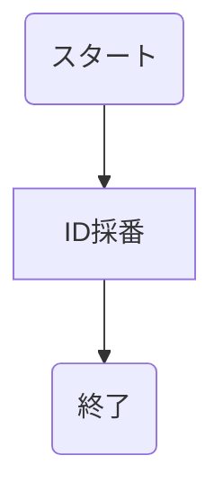

# 基本設計書 - ID採番機能

本頁ではID採番を行う機能を定義する

## フロー詳細

```mermaid
flowchart TD

start(スタート) --> ID採番
ID採番 --> fin(終了)

click ID採番 href "#ID採番機能3"

```

### ID採番機能

ランダムに発行されたID採番を実施する
ID採番はuuidを短くしたものを採用する為、必ずユニークとなる
