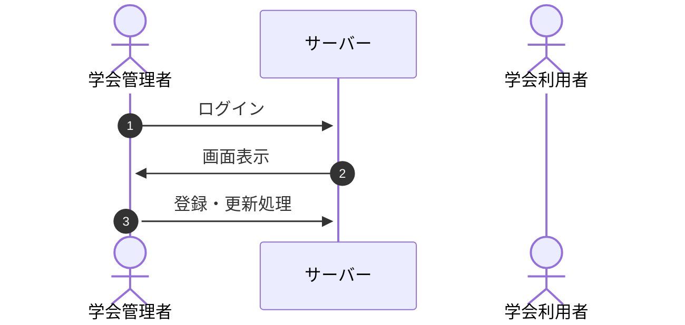
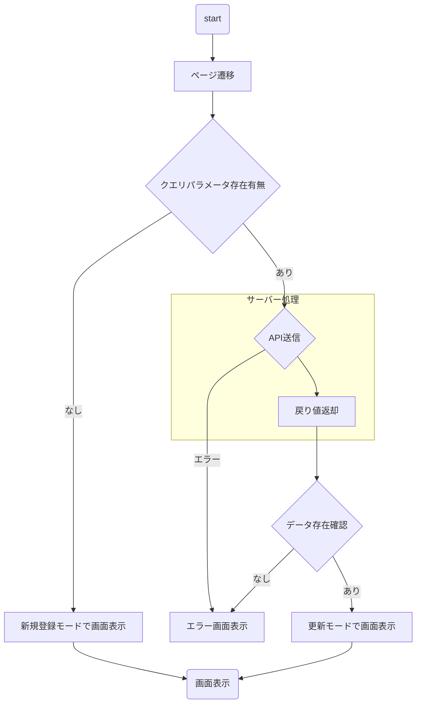
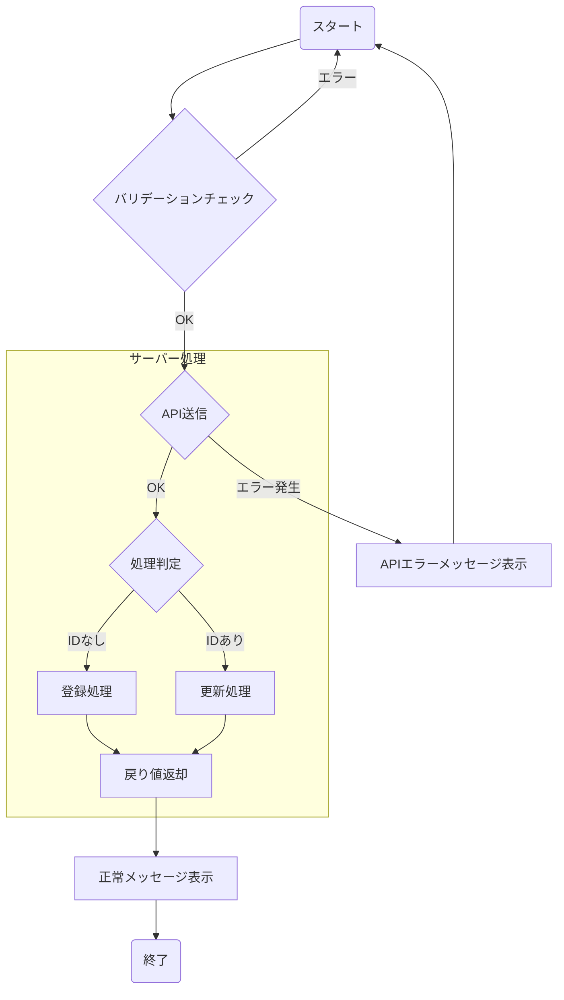

# 基本設計書 - 交通費申請データ登録・更新機能

本頁では学会管理者が使用する、交通費申請に必要となるデータ登録・更新を行える機能を定義する

## フロー概要

### 1. ログイン

本画面の機能ではないため、割愛とする
詳細は[基本設計書-学会管理者認証機能](基本設計書-学会管理者認証機能)を参照

### 2. 画面表示

ログイン済み学会管理者が対象のURLに遷移すると画面表示を実施する

#### 画面表示-詳細フロー

##### 画面表示-ページ遷移

学会管理者が対象のページを開くと動作する
※フローについては割愛

##### 画面表示-クエリパラメータ存在有無

遷移の際にURLに付与されているクエリパラメータの`id`の存在有無をチェックする。

- URLにクエリパラメータが付与されている場合
  - [API送信を実施する](#画面表示-API送信5)
- URLにクエリパラメータが付与されていない場合
  - [新規登録モードで画面表示を行う](#画面表示-新規登録モードで画面表示5)

##### 画面表示-新規登録モードで画面表示

新規登録モードで画面を表示する。
この処理で画面上にてフラグを持たせておく

##### 画面表示-API送信

入力値をAPI通信経由でサーバー側へ送信する。

| URL | HTTPメソッド |
| ---- | ---- |
| `/api/travel` | GET |

**リクエスト情報**
| キー名称 | 値 |
| ---- | ---- |
|id| クエリパラメータから取得したIDを使用する|

その他のHttpヘッダー情報は[API共通機能](基本設計書-API共通機能#リクエスト情報送信4)を参照

※APIの処理については[API共通機能](基本設計書-API共通機能)を参照

##### 画面表示-戻り値返却

前処理で送信したリクエスト情報を元にデータベースへ問い合わせ取得処理を実施する。

- `id`に一致するデータが存在する場合
  - データをセットして、フロントエンド側に返却する
- `id`に一致するデータが存在しない場合
  - `null`をフロントエンド側に返却する

##### 画面表示-データ存在確認

前処理で返却されたデータを元に判定処理を実施する

- データが存在する
  - [画面表示-更新モードで画面表示](#画面表示-更新モードで画面表示5)へ処理を進める
- データが`null`である
  - [画面表示-エラー画面表示](#画面表示-エラー画面表示5)へ処理を進める

##### 画面表示-更新モードで画面表示

更新モードで画面を表示する。
この処理で画面上にてフラグを持たせておく

##### 画面表示-画面表示

ページの読み込みが完了すると画面が表示されて入力可能な状態となる
以下の項目が表示される

| 親オブジェクト | 項目 | 物理名 | 必須 | 型 | 画面コンポーネント | 説明 |
| ---- | ---- | ---- | ---- | ---- | ---- | ---- |
| - | 氏名 | name | 〇 | string | input | 申請を行う方の氏名 |
| - | 所属 | department | 〇 | string | input | 申請を行う方の所属 |
| - | メールアドレス | email | 〇 | string | input(readonly) | メールアドレス（読み取り専用） |
| - | 対象日 | date | 〇 | Date | date | 初期値=今日の日付 |
| - | メッセージ | adminMessage |  | string | textarea | 申請者へのメッセージ |

また、アクションは以下の通りとする。

|アクション名|コンポーネント|処理|
|---|---|---|
|登録|ボタン|**前処理が新規登録モードの際に表示** 登録処理を実施する。 バリデーションチェックは変更時に実施し、どれかひとつでもエラーの場合は押下不可とする|
|更新|ボタン|**前処理が更新モードの際に表示** 更新処理を実施する。 バリデーションチェックは変更時に実施し、どれかひとつでもエラーの場合は押下不可とする|

##### 画面表示-エラー画面表示

//TODO: 404ページの追加
404ページへと遷移する

### 3. 登録・更新処理

前処理で表示されたアクションボタンをユーザーが押下した際に登録・更新処理を実施する

#### 登録・更新処理-詳細フロー

##### 登録・更新処理-バリデーションチェック

登録・更新項目のバリデーションチェックを実施する。
バリデーションのチェックについては以下の通りに実施を行う

| 親オブジェクト | 項目 | 物理名 | チェック項目 |
| ---- | ---- | ---- | ---- |
| - | 氏名 | name | 必須であること |
| - | 所属 | department | 必須であること |
| - | メールアドレス | email | 必須であること / メールアドレスの形式であること |
| - | 対象日 | date | 必須であること / 日付形式であること |
| - | メッセージ | adminMessage | なし |

上記のチェック結果の際に判定を実施する

- どれかひとつでも判定がNGである
  - エラーメッセージを表示し、次の処理へは進まない
- 全て判定がOKである
  - [登録・更新処理-API送信](#登録・更新処理-API送信5)へと進む

##### 登録・更新処理-API送信

APIの送信を行い、入力値をサーバー側へ送信する

| URL | HTTPメソッド |
| ---- | ---- |
| `/api/travel` | 登録処理の場合は`POST`  更新処理の場合は`PATCH` |

**リクエスト情報**
| キー名称 | 値 |
| ---- | ---- |
|id| 更新処理から遷移した場合は値を付与する、新規登録の際は追加しない |
|name|入力した学会申請者の氏名|
|department|入力した学会申請者の所属|
|email|入力した学会申請者のメールアドレス|
|date|入力した対象日|
|adminMessage|入力した学会申請者へ向けたメッセージ、未入力の際は空文字で送信される|

その他のHttpヘッダー情報は[API共通機能](基本設計書-API共通機能#リクエスト情報送信4)を参照

※APIの処理については[API共通機能](基本設計書-API共通機能)を参照
※エラーの場合は[APIエラーメッセージ表示](#APIエラーメッセージ表示5)へと処理へ進める

##### 登録・更新処理-処理判定

以下の判定を実施する
- `id`が存在がある
  - [登録・更新処理-更新処理](#登録・更新処理-更新処理5)へと進める
- `id`が存在がなし
  - [登録・更新処理-登録処理](#登録・更新処理-登録処理5)へと進める

##### 登録・更新処理-登録処理

[登録・更新処理-API送信](#登録・更新処理-API送信5)にて受取ったパラメーターと以下のパラメーターを作成して、登録処理を実施する

| キー名称 | 論理名| 値 |
| ---- | ---- |---- |
|id| 申請ID| 新規登録：新規で採番を実施する。採番は[ID採番機能](基本設計書-ID採番機能)を参照 更新処理：リクエスト情報を利用する |
|status| ステータス| `'ready'` (準備中) |

##### 登録・更新処理-更新処理

[登録・更新処理-API送信](#登録・更新処理-API送信5)にて受取ったパラメーターと以下のパラメーターを作成して、更新処理を実施する

##### 登録・更新処理-戻り値返却

レスポンスデータを受取り、[登録・更新処理-正常メッセージ表示](#登録・更新処理-正常メッセージ表示5)へと進める

##### 登録・更新処理-正常メッセージ表示

レスポンスデータの判定を実施する

- `true`の場合
  - 正常メッセージを表示して処理を終了する
- `false`の場合
  - エラーメッセージを表示して処理を終了する
