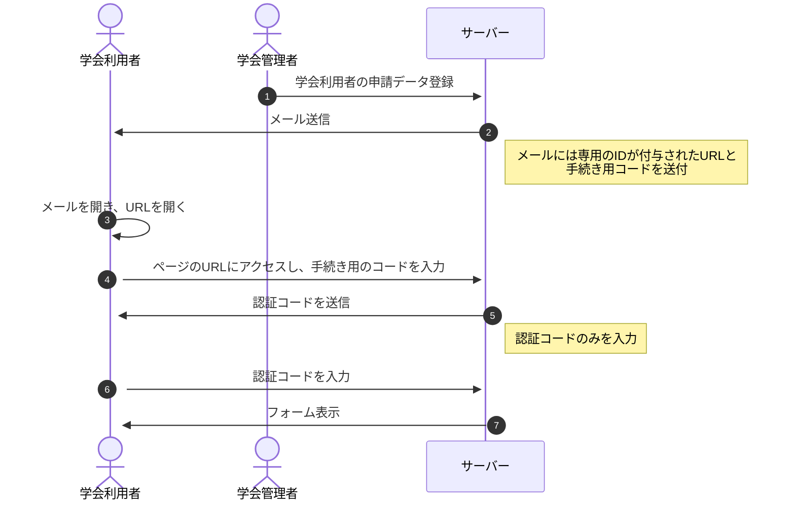
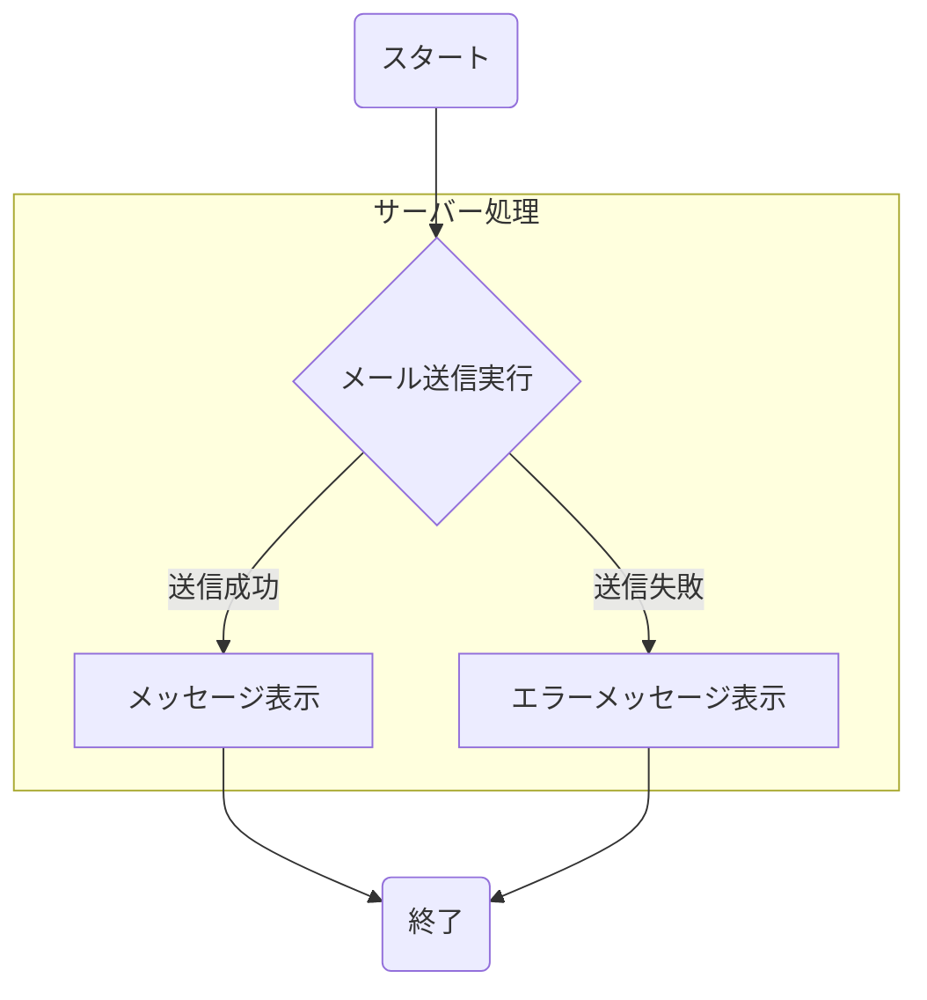
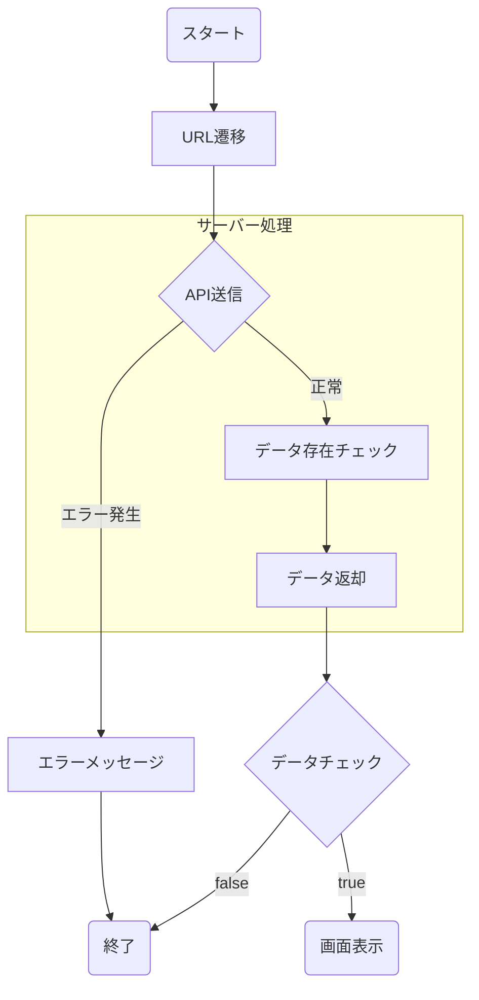
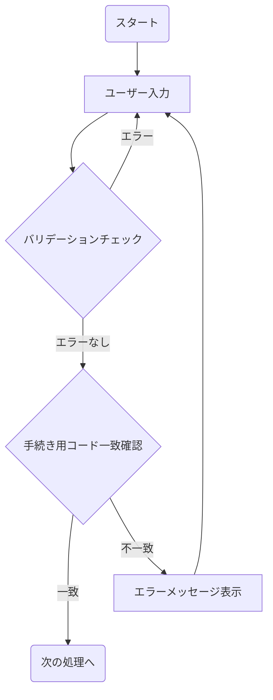

# 設計書 - 利用者認証機能

本頁では学会利用者が本Appを利用可能にするまでの認証機能を定義する

## フロー概要




本頁では認証処理のみ抜粋して記載する。
そのため、学会管理者の申請データ登録・フォーム表示以降の処理については割愛とする

### 1. 学会利用者の申請データ登録

//TODO: 申請データ登録のリンクを貼る
学会管理者が学会利用者の情報を入力し、認証可能な状態へと登録を実施
※本処理の前提となるが、本頁からは外れる為詳細については割愛


### 2. 手続き用メール送信

学会利用者（交通費の申請者）へ向けてメールを送信する。

#### 手続き用メール送信-詳細フロー



##### 手続き用メール送信-メール送信実行

メール送信を実行する、送信する内容については以下の項目となる
また、メール送信に伴う設定情報については[環境設定項目](基本設計書-環境設定#アプリケーション環境設定情報3)を参照

| 名称 | 設定値 | 備考欄 |
| ---- | ---- | ---- |
| From | 学会利用者のメールアドレス | パラメーターについては下記を参照 |
| 件名 | 交通費申請の手続きコードが発行されました。 |  |
| 本文 | {name}<br/>以下のURLをクリックして、交通費の入力をお願いします。<br/>画面が表示されたら手続き用のコードを入力してください。<br/>手続き用コード：{processCode}<br/><br/>[URL形式で ドメイン+/travel-cost/{applicantId}<br/> | パラメーターについては下記を参照 |

また、メール送信に伴うパラメーターは以下の通り

| 名称 | 物理名 | 説明 |
| ---- | ---- | ---- |
| 氏名 | name | 学会利用者の氏名、前処理の入力情報を使用 |
| 手続きコード | processCode | 自動採番の6桁の数字 |
| 申請ID | applicantId | 前処理にて発行されたユニークID |

本処理の送信結果（送信成功フラグ）を画面の処理へ返却する

- true
  - [手続き用メール送信-メッセージ表示](#手続き用メール送信-メッセージ表示5)へ進む
- false
  - [手続き用メール送信-エラーメッセージ表示](#手続き用メール送信-エラーメッセージ表示5)へ進む


##### 手続き用メール送信-メッセージ表示

メールが問題なく送信された場合は画面上に`送信が完了しました`とメッセージを表示する。

> 補足事項
> 本メールが送信された段階では特に有効期限は設けておらず、学会利用者がURLをクリックしない場合でも有効となる
> ただ、デバイスの切り替え（PCの買替・機種変更）などでメールの紛失が予想されるため
> その際は学会管理者が同条件でメールの再送信を可能にする、この操作を行った場合は手続きコードの更新のみとする

##### 手続き用メール送信-エラーメッセージ表示

送信が失敗した場合、`エラーが発生しました`と表示する。

### 3. URL表示

本処理にてURLの妥当性チェックを実施する

#### URL表示-詳細フロー



##### URL表示-URL遷移

交通費申請者がメールに記載されたURLをクリックし、画面を表示する
URLには申請IDが付与されているが、安全性のために後続の処理にてURLの妥当性を確認する

##### URL表示-API送信

URLに付与されたパラメーターを元にサーバー側へリクエストを送信する

| URL | HTTPメソッド |
| ---- | ---- |
| `/api/code/init` | GET |

**リクエスト情報**
| キー名称 | 値 |
| ---- | ---- |
| id | クエリパラメータに付与されたID |


その他のHttpヘッダー情報は[API共通機能](基本設計書-API共通機能#リクエスト情報送信4)を参照

##### URL表示-データ存在チェック

前処理で送信したリクエスト情報を元にデータベースへ存在確認を実施する
Firebase DataStoreへとアクセスを実施する

- データが存在している場合
  - `true`を返却する
- データが存在していない場合
  - `false`を返却する

##### URL表示-データ返却

前処理の判定結果をレスポンスとして返却する

##### URL表示-データチェック

レスポンスデータを元に下記の処理分岐を実施する

- `true`の場合
  - [URL表示-画面表示](#URL表示-画面表示5)へと進む
- `false`の場合
  - [URL表示-エラーメッセージ](#URL表示-エラーメッセージ5)へと進む

##### URL表示-画面表示
 
画面が正常に表示され、入力可能な状態となる

##### URL表示-エラーメッセージ

エラー画面へと遷移する

### 4. 手続き用コード入力

学会利用者はメールにて記載された手続き用コードを入力する。
正しい値を入力すると次工程へと進む

#### 手続き用コード入力-詳細フロー



##### 手続き用コード入力-ユーザー入力

ユーザーがメールに送付された手続き用コードを入力し、送信ボタンを押下する
(入力中でもバリデーションチェックは実施される)

##### 手続き用コード入力-バリデーションチェック

以下の条件で入力値の妥当性チェックを実施する
全て条件を合格してることとする

| 条件 |
| ---- |
| 入力値が存在している |
| 6桁の入力値である |
| 半角数字である |

- 条件が全て満たしている
  - [手続き用コード入力-手続き用コード一致確認](#手続き用コード入力-手続き用コード一致確認5)へと進む
- いずれかの条件に満たしていない
  - [手続き用コード入力-ユーザー入力](#手続き用コード入力-ユーザー入力5)へと進む


##### 手続き用コード入力-手続き用コード一致確認

データベースに登録されている手続き用コードの確認を実施するために、サーバー側へリクエストを送信する

| URL | HTTPメソッド |
| ---- | ---- |
| `/api/code/check` | POST |

**リクエスト情報**
| キー名称 | 値 |
| ---- | ---- |
| processCode | 画面上で入力された手続きコード |

その他のHttpヘッダー情報は[API共通機能](基本設計書-API共通機能#リクエスト情報送信4)を参照

※APIの処理については[API共通機能](基本設計書-API共通機能)を参照

リクエストで受け取った手続き用コードをデータベース


##### 手続き用コード入力-エラーメッセージ表示


### 5. 認証コードを送信

### 6. 認証コード入力

### 7. フォーム表示

//TODO: リンク
本頁では割愛とする。詳しくは


#### フロー項目


//TODO: メモ

```
- ページを開く
- クエリパラメータのID✅
  - OKならば次へ
- メールに付与された手続き用コードを入力
- 認証コードが届く
  - 入力してフォームが標示される
```