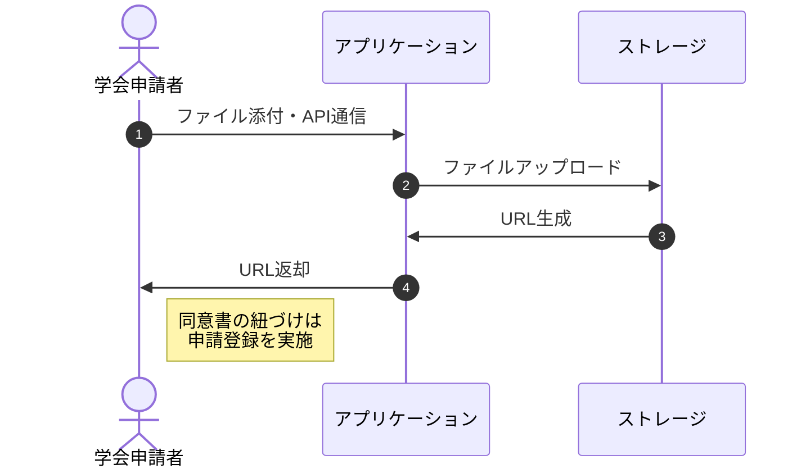
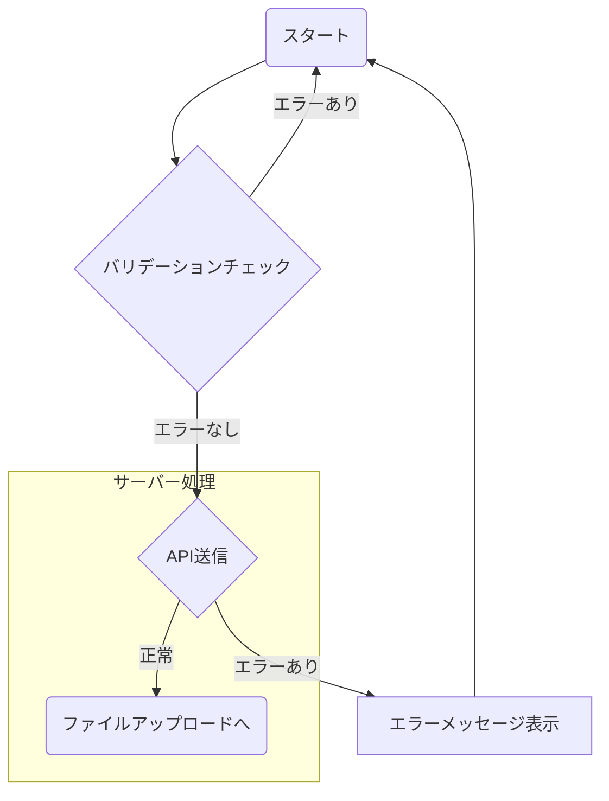
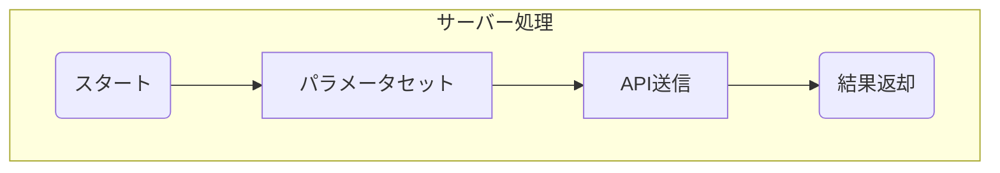
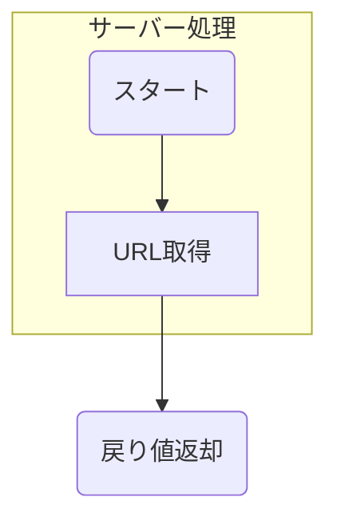
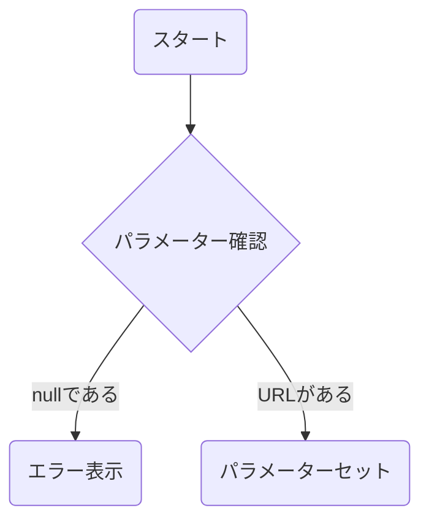

# 基本設計書-同意書アップロード機能

本頁では同意書をアップロードする機能を定義する

## フロー詳細

### 1. ファイル添付・API通信

画面上からファイルを添付してアップロードを実施する。

#### ファイル添付・API通信-詳細フロー

##### ファイル添付・API通信-バリデーションチェック

//TODO: ファイルの形式を確認。PDF / PNGのみにするか？

ユーザーが画面上で同意書を添付する。
添付の時点でバリデーションチェックを実施する
バリデーションのチェックについては以下の通りに実施を行う

| 親オブジェクト | 項目 | 物理名 | チェック項目 |
| ---- | ---- | ---- | ---- |
| - | 添付ファイル | file | 必須であること / ファイルの形式がJPEG / PNG / PDFであること |

いずれかのエラーが発生した場合はエラーメッセージを表示し、処理を元に戻す

##### ファイル添付・API通信-API送信

APIの送信を行い、入力値をサーバー側へ送信する。

| URL | HTTPメソッド |
| ---- | ---- |
| `/api/consentForm` | `POST`|

**リクエスト情報**
| キー名称 | 値 |
| ---- | ---- |
|id | ＋ボタンを押下した際に発行されたID |
|file| 添付するファイルデータ(PNG / JPEG / PDF) |
|fileName| ファイル名称 |
|type | ファイル形式。fileデータをアップロードした際にセットする |

その他のHttpヘッダー情報は[API共通機能](基本設計書-API共通機能#リクエスト情報送信4)を参照

また今回はファイルをアップロードする為、JSON形式では送信が出来ない。
**そのため、Httpヘッダーの`content-type`は`multipart/formdata`を採用する。**

※APIの処理については[API共通機能](基本設計書-API共通機能)を参照
※エラーの場合は[APIエラーメッセージ表示](#APIエラーメッセージ表示5)へと処理へ進める

##### ファイル添付・API通信-ファイルアップロードへ

次の処理へと進む

##### ファイル添付・API通信-エラーメッセージ表示

API通信が失敗した場合はエラーメッセージを表示して画面に戻る

### 2. ファイルアップロード

前処理にて設定したパラメータを元にファイルアップロードを実施する
アップロード先は[Firebase CloudStorage](要件定義書-Firebase#FirestoreCloudStorage3)を採用する

#### ファイルアップロード-詳細フロー

##### ファイルアップロード-パラメータセット

Firebase CloudStorageで必要なパラメーターをセットする
前処理にて受取ったパラメーターを使用して、本処理で追加のパラメーターを作成する

| キー名称 | 論理名| 値 |
| ---- | ---- |---- |
|id| ファイルID| 前処理にて受取った`id` |
|file | ファイル名称 | 前処理にて受取ったファイルデータ（バイナリ）|
|fileName| ファイル名称 | 前処理にて受取ったファイル名称 |
|type | ファイル形式 | 前処理にて受取ったファイル形式 |

更に新規でファイルパスを生成する。ファイルパスは下記の形式とする

`/consent/{id}/{fileName}`

##### ファイルアップロード-API送信

Firebaes CloudStorageの機能を使用して対象のファイルをアップロードする。

|名称|値|
|---|---|
|ストレージバケット|[環境設定](基本設計書-環境設定#アプリケーション環境設定情報3)にて定義|
|ファイルパス|前処理にて生成したファイルパス|
|ファイル形式|前処理にて受取ったファイル形式|
|ファイル|前処理にて受取ったファイル|
|public|公開フラグ：`true`を設定する|

##### ファイルアップロード-結果返却

アップロードした結果に応じて次の[3. URL生成](#3.URL生成3)にて処理を実施する

### 3. URL生成

Firebase CloudStorageの機能を使用し、生成されたURLを取得する

#### URL生成-詳細フロー

##### URL生成-URL取得

発行されたURLを取得する。
取得が失敗した場合は`catch`句を使用し、`null`を変数にセットする

##### URL生成-戻り値返却

前処理にてセットしたURLのパラメーターをフロントエンド側に返却する

### 4. URL返却

前処理にて受取ったURLの値を確認し、結果に応じた処理を実施する

#### URL返却-詳細フロー

##### URL返却-パラメーター確認

サーバー側から返却された値を確認し、以下の判定を実施する

- URLが`null`である
  - [URL返却-エラー表示](#URL返却-エラー表示5)へと進む
- URLの値がある
  - [URL返却-パラメーターセット](#URL返却-パラメーターセット5)へと進む

##### URL返却-エラー表示

エラーメッセージを表示する

##### URL返却-パラメーターセット

パラメータを交通費の配列にセットする

> 本URLは最終的に交通費申請の登録処理にて送信を実施する。
> 交通手段の列を削除した場合は使用されない