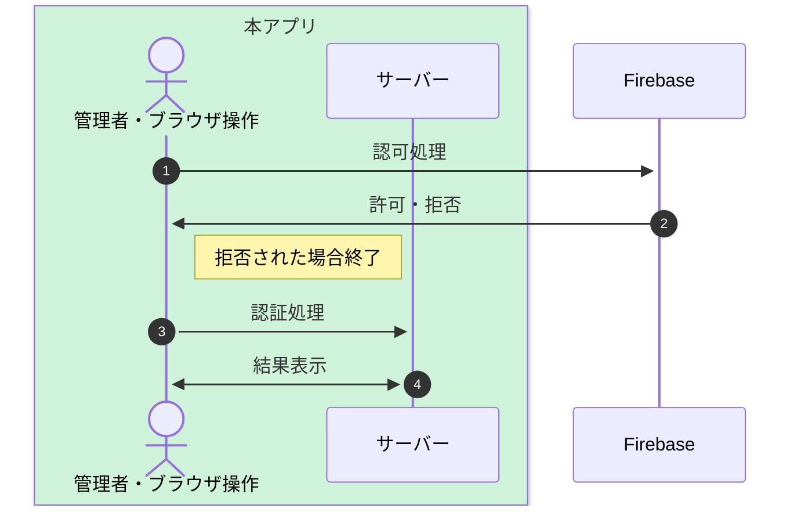
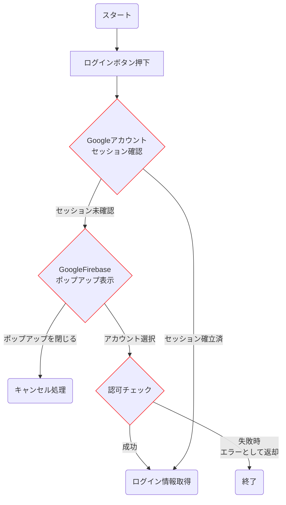
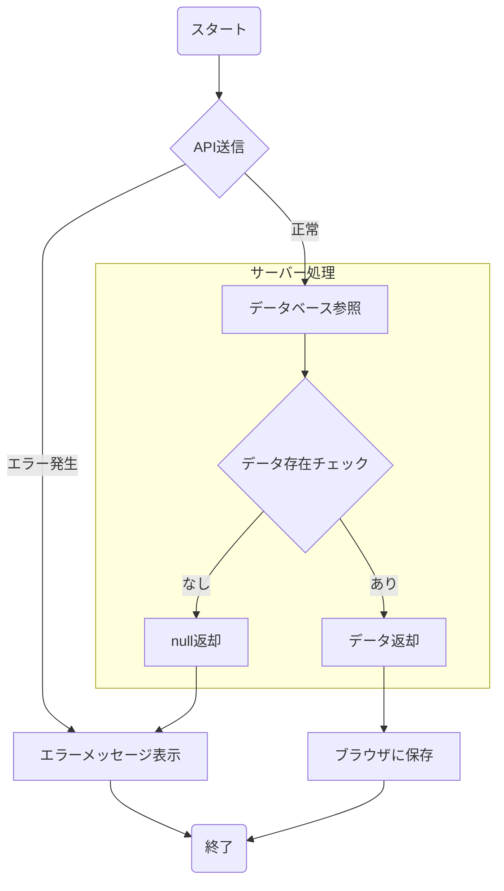

# 基本設計書 - 学会管理者認証機能

本頁では、学会管理者向けの認証機能を定義する
※学会利用者向けの認証は別の方式を取る為、別頁にて記載する

## 基幹機能

本頁では[Firebase Authentication](要件定義書-Firebase#FirebaseAuthentication3)を使用する。
上記の詳細については上記リンクに記載する

## フロー概要(Firebase)

### 1. 認可処理

Googleアカウントが正常に作成されつつ、ユーザーの意思で作成されたかどうかを確認する
※外部ツールやスクリプトなどで不正に操作されていないかも本処理で確認・ブロックが可能

#### 認可処理フロー

##### ログインボタン押下

画面上に表示されたログインボタンを押下する
押下すると次の処理に移動する

##### Googleアカウントセッション確認

Googleのアカウントがブラウザ側でセッションが確立されてるかかどうかを確認する
既にセッションが確立済みの場合は以下の情報を付与して[認可処理](#認可処理5)へ移動する

| 名称 | 物理名 | 説明 |
| ---- | ---- | ---- |
| メールアドレス | email | gmailアドレス  |
| ユーザーID | uid | 発行されるユーザーID（アプリ側で発行されるユニークID） |
| 表示名 | displayName | Googleで使用してる表示名 |
| メールアドレス検証結果 | emailVerified | emailの確認が行われていないケースは`false`になる |
| IDトークン | idToken | Google側が発行したIDトークン。こちらの値を用いてサーバーとの疎通を実施する |

セッションが切れてる場合や確認できない場合は[GoogleFirebaseポップアップ表示](#GoogleFirebaseポップアップ表示5)へ移動

##### GoogleFirebaseポップアップ表示

Googleのサービスを介して、ポップアップが表示される。
以下のユーザー操作によって分岐が発生する

- ログインするアカウントを選択した場合
  - 既に本Appにログイン済のデバイスからのログインの場合、[認可チェック](#認可チェック5)へ進む
  - 未ログインの場合や履歴が確認できない場合、パスワードを求められる
  - ※こちらはGoogle側にて管理している為、本App上でパスワードの取得は不可となる
- 選択せずにキャンセルを行った場合
  - [キャンセル処理](#キャンセル処理5)へ進む

##### 認可チェック

Google側にてGoogleアカウントの認可を行う
この際に以下のユーザー情報が返却される

※本Appにて管理・使用する情報のみ抜粋

| 名称 | 物理名 | 説明 |
| ---- | ---- | ---- |
| メールアドレス | email | gmailアドレス  |
| ユーザーID | uid | 発行されるユーザーID（アプリ側で発行されるユニークID） |
| 表示名 | displayName | Googleで使用してる表示名 |
| メールアドレス検証結果 | emailVerified | emailの確認が行われていないケースは`false`になる |
| IDトークン | idToken | Google側が発行したIDトークン。こちらの値を用いてサーバーとの疎通を実施する |

返却された`メールアドレス検証結果`にて分岐を実施

- メールアドレス検証結果が`true`の場合
  - ログイン情報を取得し、[ログイン情報取得](#ログイン情報取得5)へと進む
- メールアドレス検証結果が`false`の場合
  - [認可処理異常終了](#認可処理異常終了5)へと進む

##### ログイン情報取得

前処理で取得したデータを使用し、次の処理へと移動

##### キャンセル処理

ポップアップを閉じた処理に本処理が動作する
エラーメッセージを表示し処理を終了する

##### 認可処理異常終了

メールアドレス検証結果が`false`の場合、本処理が動作する。
エラーメッセージを表示し処理を終了する
※本処理はリロードをしない限り再度処理を行えないように制御する

 

#### 2. 認証処理 / 結果表示表示

本処理では正常に認可されたアカウントが本Appを使用する権限があるかどうかをチェックする
そのため、前処理にて取得したユーザー情報を元にアカウントチェックを実施する

##### 認証処理フロー

##### API送信

前処理にて取得したユーザー情報を元にサーバー側へリクエストを送信する

| URL | HTTPメソッド |
| ---- | ---- |
| `/api/user` | GET |

その他のHttpヘッダー情報は[API共通機能](基本設計書-API共通機能#リクエスト情報送信4)を参照

 

**リクエスト情報**
| キー名称 | 値 |
| ---- | ---- |
| uid | Firebaseから発行されたユーザーID |

※APIの処理については[API共通機能](基本設計書-API共通機能)を参照

##### データベース参照

前処理で送信したリクエスト情報を元にデータベースへ存在確認を実施する
Firebase DataStoreへとアクセスを実施する

##### データ存在チェック

データの結果を参照し、以下の処理分岐を実施する

- データが存在する場合
  - [データ返却](#データ返却5)へと進む
- データが存在しない場合
  - [null返却](#null返却5)へと進む

##### データ返却

以下のデータをJSON形式にて返却する

| 親オブジェクト | 名称 | 物理名 | 説明 |
| ---- | ---- | ---- | ---- |
| - | ユーザー | User | ユーザーオブジェクト |
| User | ユーザー名 | name | ユーザー名 |
| User | メールアドレス | email | メールアドレス |
| User | ユーザーID | uid | 発行されるユーザーID（アプリ側で発行されるユニークID） |
| User | 削除フラグ | deleted | 削除フラグ（`true`=削除済） |

##### null返却

データが存在しない場合は`null`を返却する

##### エラーメッセージ表示

サーバー側との疎通が失敗した場合、またはユーザーのデータが存在しない場合はエラーメッセージを表示する

| エラーメッセージ | 備考 |
| ---- | ---- |
| エラーが発生しました | 原因関してはセキュリティの問題もあるため、明示しない |

##### ブラウザに保存

//TODO: リンク
Reduxの機能を使用し、ブラウザ側に保存処理を行う
学会管理者専用機能はブラウザ側に保存されたトークンを用いて、専用のAPIにアクセスが可能になる

