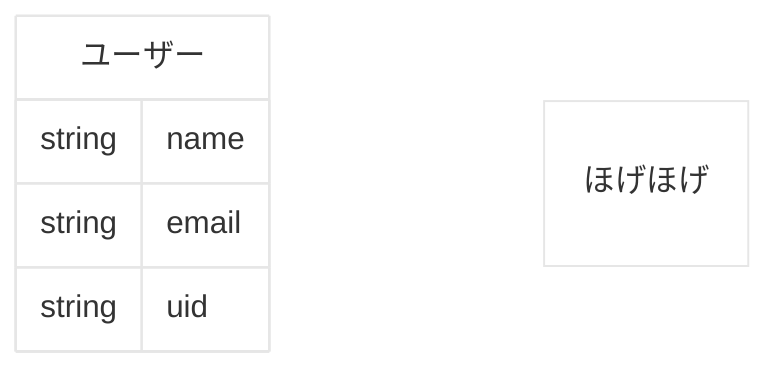

# Firebaseについて

本システムはGoogleの[Firebase](https://firebase.google.com/?hl=ja)を使用します。

## 使用する機能
| 機能名                     | 概要     | 概要                                  |
|-------------------------|--------|-------------------------------------|
| Firebase Authentication | 認可機能   | Google認可機能を用いて、安全かつパスワードを保持せずに運用が可能 |
| Firestore Database      | データベース | NOSQLのデータベースでの管理で、データベースの変更が容易      |

### Firebase Authentication

Google認可機能を用いて、安全かつデータベース上にパスワードを保持せずに運用が可能な機能です。
上記の機能を用いたフローや大まかの流れについては[基本設計書-学会管理者認証機能](基本設計書-学会管理者認証機能)に記載。

### Firestore Database

今回使用するデータベース情報を定義します。

詳細は[基本設計書-データベース定義書](./基本設計書-データベース定義書)

**※本項目は基本設計後にFIX予定**

