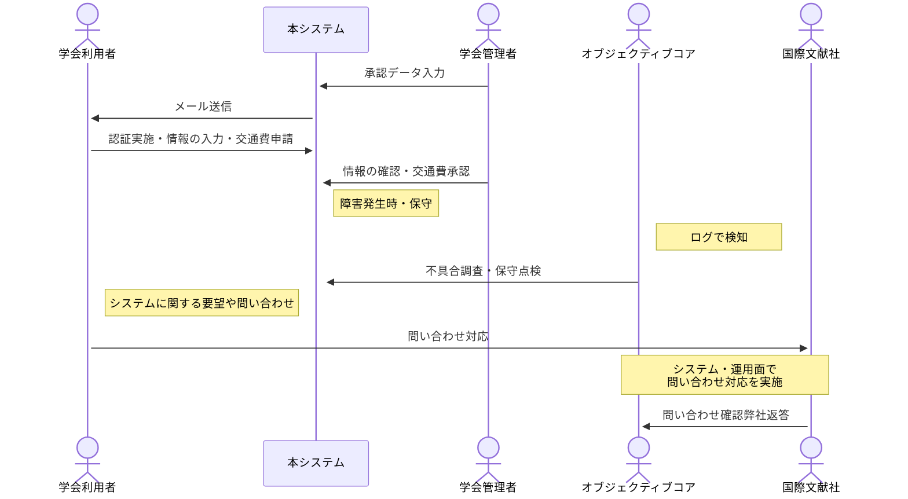
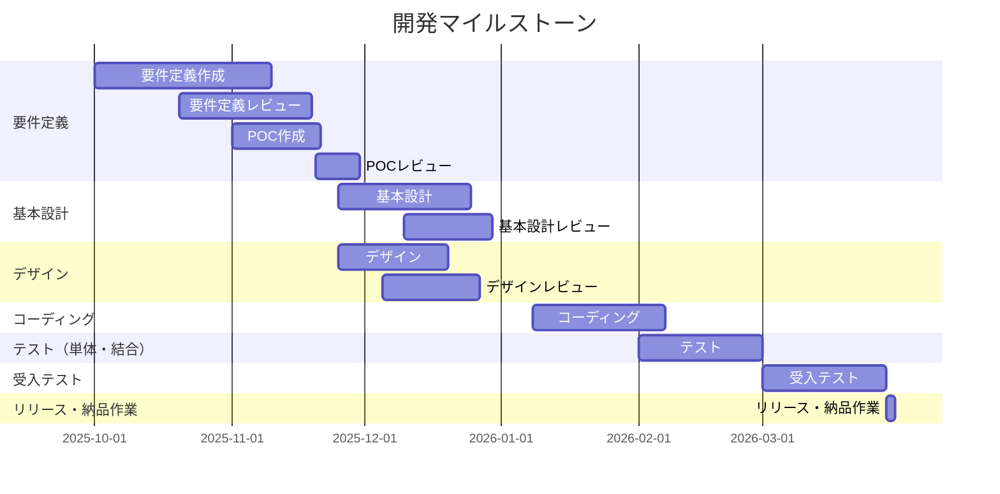
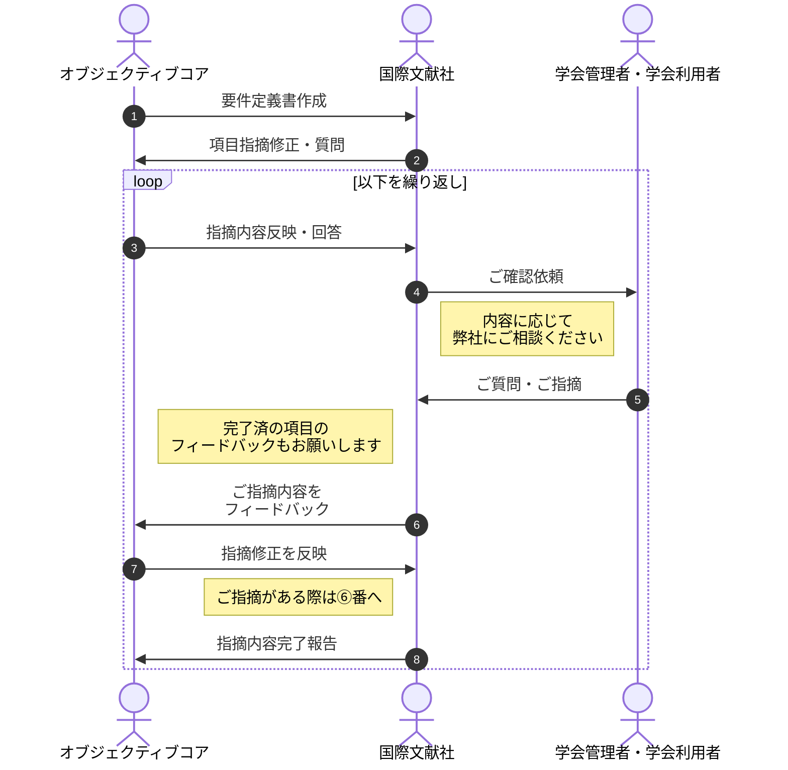
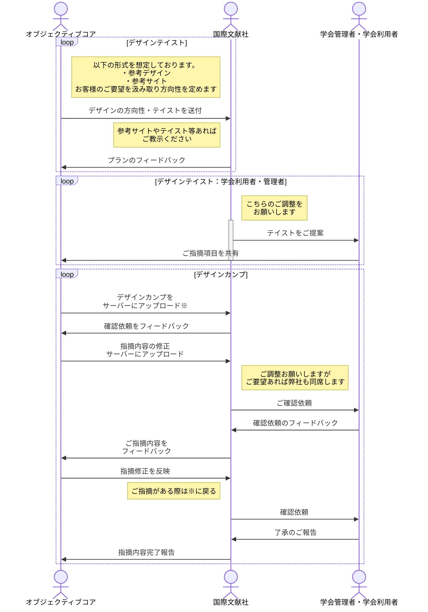
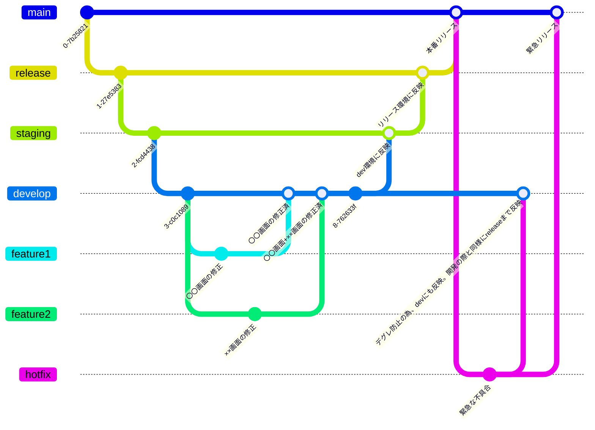

# 要件定義書

## 更新履歴

|日付|版|更新者|更新内容|
|---|---|---|---|
|2025/10/01|0.1|OCR中上|新規作成|
|||||

## 前提となる文言

本ドキュメントでは以下の文言を用い、認識の齟齬を防ぎます。

|用語|解説|
|---|---|
|学会利用者|システムを使用する人間、交通費の申請者、学会の方|
|学会管理者|システムを管理する人間、交通費の承認者、運用する人間|
|開発元・オブジェクティブコア|開発元である株式会社オブジェクティブコア|
|国際文献社|株式会社国際文献社さま|

## 概要

以下の要件に合致するシステムを作成します
- スクラッチ開発にて、交通費管理をシステム化を実施
- 手書き・FAX・メールでの申請をWebにて統一する
- お客様の個人情報はメールを徴収さえ出来れば申請が可能にする
- 自動計算の機能を行い、作業コストの低減を実施する
- 同意書のアップロード機能を実施し、エビデンスを担保する

## 業務要件

### ステークホルダー
本システムに関連するステークホルダーを記載します。
また、全体的なシステムを利用する上での関係図を記載しております

## 機能・非機能要件

本プロジェクトを成功させるために、以下の機能を提供いたします。

### 機能要件
お客様からご提示のあった要件・またはそれに関連する機能の一覧となります。

|機能名|
使用者
|概要|詳細|備考欄|
|---|---|---|---|---|
|[認証機能](/設計書-認証機能)|学会管理者|管理システムでのログイン、認証・認可処理を実施|ログイン方式は信頼性の高いGoogle Firebase Authenticationを採用とする|[パスワード変更については別途認証機能で記載](/設計書-認証機能)|
|[交通費申請一覧](/設計書-交通費申請一覧)|学会管理者|申請された交通費を一覧表示する||
|[交通費申請詳細](/設計書-交通費申請詳細)|学会管理者|申請された交通費を詳細表示する|承認・否認も本機能で実施する|
|[同意書アップロード機能](/設計書-同意書アップロード機能)|学会利用者|申請されたフォームに同意書をアップロードする||
|[交通費申請](/設計書-交通費申請)|学会利用者|交通費申請を行う||
|[ワンタイムURL発行機能](/設計書-ワンタイムURL発行機能)|学会利用者|一時的な認証を許可する為のURLを発行する||

※追加のご要望に関しては別途スケジュール・要件を定義させて頂きます。

### 非機能要件
お客様からご提示はございませんでしたが、システムの挙動を担保するための機能一覧となります。

|機能名|
使用者
|概要|詳細|備考欄|
|---|---|---|---|---|
|[排他制御](/設計書-排他制御)|共通|意図しないデータ更新を行わせないためのロック機能||
|[各種データクリーニング](/設計書-各種データクリーニング)|共通|古くなったデータを定期削除する||
|[各種エラー制御](/設計書-各種エラー制御)|エンドユーザー|一時的な認証を許可する為のURLを発行する||

### 全機能とのシナリオフロー

## 環境
以下のシステム構成で動作いたします。

| 大項目         | 項目           | 内容                           | 備考欄                  |
|-------------|--------------|------------------------------|----------------------|
| ハードウェア      | CPU          | Vercel / サーバーレス環境            | プランによって異なります         |
| ハードウェア      | メモリ          | Vercel / サーバーレス環境            | プランによって異なります         |
| ハードウェア      | ストレージ        | Firebase Storage             | 添付ファイル・画像などを格納       |
| ハードウェア      | ネットワーク       | 帯域制限なし、Vercel CDNを利用         | プランによって異なります         |
| ソフトウェア      | Webサーバー      | Vercel / サーバーレス環境            |                      |
| ソフトウェア      | アプリケーションサーバー | Vercel / サーバーレス環境            |                      |
| ソフトウェア      | フレームワーク      | Next.js                      |                      |
| ソフトウェア      | データベース       | Firebase Cloud Firestore     |                      |
| ソフトウェア      | その他ライブラリ     | [使用ライブラリ参照](./使用ライブラリ)                    |                      |
| 使用技術        | 言語           | React.js (TypeScript)        |　サーバー環境も同様のNext.jsを採用                      |
| 使用技術        | バージョン管理      | Git                          | Gitのリモート環境はGitHubを採用 |
| 使用技術        | CI/CD        | GitHub Action                |                      |
| 使用技術        | IDE/エディタ     | VSCode                       |                      |
| 使用技術        | ドキュメント       | 本Webにて公開                     | PJT終了後はPDFにてご納品      |
| 設定          | 環境変数         | [環境設定は別紙参照](./基本設計書-環境設定)                    |                      |
| 設定          | 設定ファイル       | [設定ファイル一覧は環境設定に同梱](./基本設計書-環境設定)                  |                      |
| サーバ構成       | 本番環境         | Vercel / サーバーレス環境            | [動作確認について](./動作確認)    |
| サーバ構成       | ステージング環境     | Vercel / サーバーレス環境（Proプラン)  | [動作確認について](./動作確認)        |
| サーバ構成       | 開発環境         | Vercel / サーバーレス環境（Proプラン)  | [動作確認について](./動作確認)        |
| ログ・監視       | ログ管理         | Vercel / サーバーレス環境（Proプラン)  | [動作確認について](./動作確認)        |
| ログ・監視       | 監視ツール        | Vercel / サーバーレス環境            |                      |
| デプロイ手順      | -            | Vercel / サーバーレス環境での動作        | [動作確認について](./動作確認)        |
| バックアップ・リカバリ | バックアップポリシー   | [Firebase Blazeプラン](./Firebase)での契約        |                      |
| バックアップ・リカバリ | リストア手順       | [Firebase Blazeプラン](./要件定義書-Firebase)で、データの復元を行う |                      |
| セキュリティ      | 認証・認可        | [Firebase Authentication](./要件定義書-Firebase)      | データは保護観点でSSL通信を採用    |
| セキュリティ      | アクセス管理       | [アクセス管理について](./アクセス管理について)                   |                      |
| その他         | 問い合わせ先       | 国際文献社・オブジェクティブコア               |

### Vercelについて
今回システムの大部分に用いるVercelについての補足説明となります。
[公式サイト](https://vercel.com/)

- 基本情報
  - サーバーレスで動作するSaaS

| プラン名称      | CPU      | メモリ    | 備考欄                      |
|------------|----------|--------|--------------------------|
| Hobby      | 1 vCPU   | 1024MB |                          |
| Pro        | 1-2 vCPU | 最大16GB | ※使用想定やコストパフォーマンスの判断にてこちらを採用させて頂きます |
| Enterprice | カスタム     | 最大16GB |

## 開発工程の流れ
お客様との成果物を通したコミュニケーションの流れについて

### スケジュール

大まかなスケジュールは以下の通りとさせて頂きます。

//TODO: 確認ポイント

### 進捗報告について
お客様と弊社間での逐一のコミュニケーションのご協力をお願いしております。

### オンラインMTG

//TODO: 確認ポイント

定期的な要件のすり合わせ、ご要望の確認や認識あわせのため定期的なオンラインMTGをお願いしております。

- 開催方法
  - Zoom / Google Meet
- 開催頻度
  - 隔週（〇曜日） or 毎週（〇曜日）
- 参加メンバー
  - 弊社・お客様で最低1名以上で開催
- 

### 進捗管理

弊社ガントチャートを使用します
ガントチャート上では2種類の進捗管理を実施します。
各プロジェクトを作成して共有

- **内部進捗管理**
  - 参加者
    - オブジェクティブコア
    - 国際文献社さま
  - 目的
    - 2社間での課題整理、未確定の仕様の整理
    - 細かい点やシステム仕様の部分でエンド様に関わらない箇所を網羅的に検討する
- **外部進捗管理**
  - 参加者
    - オブジェクティブコア
    - 国際文献社さま
    - 学会管理者・学会利用者
  - 目的
    - 2社間での課題整理、未確定の仕様のご判断
    - 要件を達成すべく必要な事項の洗い出しなどをリスト化
    - その他学会利用者・学会管理者さまへに協力を煽ぐ際に必要な内容の共有等

## 各工程の進め方

### 要件定義

#### コミュニケーションフロー
下記の流れで実施させて頂きます。

#### ドキュメントについて

- 納品前
  - Webでの公開を実施する
    - ※こちらはBasic認証を用い、一部関係者にしか共有しない方針で進める
  - レビューについてはガントチャート・Slackにてご指摘を頂く
  - 変更管理についてはGitHubにて実施する
- 学会関係者提出後
  - Webでの効果を実施する
  - レビューについてガントチャートにて起票して頂く
- 納品後
  - 上記で確認して頂いた事項をPDFにて納品する

##### ご留意事項
以下の内容をお願いしております。
- 要件定義の内容は注視すべき項目・そうではない項目が顧客によって優先度が異なります
  - ご指摘がない項目についても、分かる範囲で構いませんのでご教示お願いします
- ご不明な点は五月雨でも構いませんので、随時ご教示いただけますと幸いです。
  - 別途質問票を展開させて頂きますので、分かるタイミングで随時ご回答ください

##### ご確認・ご納品項目
以下の形式を想定しております
- 確認項目
  - 本Webサイトにて指摘修正を反映いたします
- 納品項目
  - 本WebサイトをPDFにした形式を送付いたします

### 基本設計
#### コミュニケーションフロー

下記の流れで実施させて頂きます。

#### ドキュメントについて

- 納品前
  - Webでの公開を実施する
    - ※こちらはBasic認証を用い、一部関係者にしか共有しない方針で進める
  - レビューについてはガントチャート・Slackにてご指摘を頂く
- 学会関係者提出後
  - Webでの効果を実施する
  - レビューについてガントチャートにて起票して頂く
- 納品後
  - 上記で確認して頂いた事項をPDFにて納品する

### デザイン
#### コミュニケーションフロー
下記の流れで実施させて頂きます。

#### デザインファイル

- 納品前
  - Adobe XDの機能を用いてWebサイトの画面を表示
- 納品後
  - .xdファイルに納品する
  - ※確認自体は済んでるため、最終的なアプリのリリース後に納品を実施する

### コーディング

以下の留意点を厳守する

- コンポーネント志向を徹底する
- 弊社内製のデザインフレームワークを用い、テスト工数・品質の向上・コストカットを実施
  - 特殊なUI等は別途ご相談事項となりますので、予めご了承ください
  - 該当フレームワークにて不具合が発見された場合、フレームワークの改善を実施しバージョンアップを実施する

#### ソースコード管理

- GitHubにて管理を行う
  - 各環境にCI/CDを組み、変更や各環境に影響を与えないブランチ管理を実施する
  - 詳しくは[GitHubのブランチ管理について](#GitHubのブランチ管理について5)参照

##### GitHubのブランチ管理について

各ブランチの運営については以下の通りで実施する

- main
  - 本番環境のブランチ
- release
  - 学会関係者向けのテスト環境
- staging
  - 国際文献社さま・オブジェクティブコアのメンバーの動作確認・テスト環境
- develop
  - 内部で確認する環境、開発者同士が現状の動作を確認する環境
- feature1
  - 開発者が作成したブランチ。名前は`feature/機能名英字`などの名称で作成
- feature2
  - 開発者が作成したブランチ。名前は`feature/機能名英字`などの名称で作成
- hotfix
  - 本番障害などの不具合が発生した際に緊急で対応するブランチ
  

### テスト

以下の工程にて実施を行います

#### テスト計画書

テスト計画書を事前に展開し、学会関係者さま・国際文献社さまへの承認後に実施を行う

#### 単体テスト

- メソッド単位でのテストを実施
- CI/CDにてテスト実行プログラムを組み、常に単体テストが通過した状態を担保する
- テストの実現性が難しい場合は都度国際文献社さまへご相談を行い、結合テストにて重点的に実施する
- 他モジュールやデータ依存が強いメソッドの場合、Mockにて実装を行い理論上のテストを実施
  - 本メソッドに関連する機能については結合テストにて重点的な動作確認・テストを実施する
- テスト内容についてはコーディングに記載された通りとなるが、実行結果についてはログを送付する
  

#### 結合テスト

- 実際の画面を動作しテストを実施する
- React.jsの特性上、画面リロード時・ある一定の操作の後にて動作が異なるため、重点的に実施を行う
- 実際のテスト内容については別途テスト計画書を送付、それに沿った実行結果を送付する
  - 実行結果についてはエビデンスを別途送付する

#### テスト実施結果について

テスト実施後についてはテスト結果とエビデンスを送付し、納品完了とする

### デプロイ

- GitHub / Vercelにて自動的なデプロイが可能
  - ソースコードの反映しGitのマージ機能を用いると自動的に単体テスト実行後、全て問題なければ自動デプロイをされるように設定する
- リリース前 / 後の運用を加味し環境別にてサーバーを構築、それに関連してGitブランチを分け安全かつ機動力の高い運動を行う
  - ※詳細は[GitHubのブランチ管理について](#GitHubのブランチ管理について5)をご確認ください。

### 納品物・ご提示する環境等

各工程における納品物ををまとめると納品物は以下の通りとする
また、箇条書きの見出しは納品タイミングとし、納品物ではないが展開が必要なものも含めて記載

- 要件定義終了後
  - 要件定義書
- デザインの承認終了後
  - 特になし
- 設計業務終了後
  - 設計書
- コーディング完了後
  - 動作確認用のURLを展開する（納品物ではないが、完了後にご提示）
  - 動作確認用のURLはstaging環境から作成する
  - テスト計画書
- テスト実施後
  - テスト計画書に実施結果を追記して提出する
  - テスト結果のエビデンス
  - releaseブランチから作成した環境（URL）
- シナリオテスト終了後
  - ソースコード（現状のソースコードをzipにて納品）
  - 各環境のアクセス権
  - XDファイル
  - 本番環境の構築
  - 各ドキュメントファイルをPDFにて納品

## 移行要件

### システム移行について
今回は現行となるシステムが存在しない為、システム自体の移行はなし

### データの移行について

- 運用を可能にするため、初期値となるデータを投入する
  - 学会管理者のアカウント情報のデータは都度保守対応にて実施を行う
  - ※本機能の実装コスト削減のため、上記の方針とする
- システム稼働の結果蓄積される不要データは[各種データクリーニング](基本設計書-各種データクリーニング)にて実施を行う

## 運用

システムが正常に稼働できるように保守対応を実施する

### 保守対応について
以下の対応を実施する

#### 不具合対応

- アプリケーションの動作上の問題が起きる問題
- 脆弱性などの優先度が高い問題

#### 既存ページへ要素の追加などご要望の対応

- コンテンツレベルのものを追加
  - DBへの変更が極力なく、依存関係が少ないもの
  - 例：リンクを追加する、簡単なボタンの設置等
※具体的には要件次第で一度ご相談のうえ、ご提案内容を提示

#### データクリーニング / バックアップ

- データが問題なく削除・実行されているかを確認する
- バックアップが実施できているかの確認

##### サーバー状態のチェック

- サーバーの稼働状態が問題なく動作しているかの確認
- ログ出力を確認し、セキュリティの問題やパフォーマンス測定を定期的に行う

